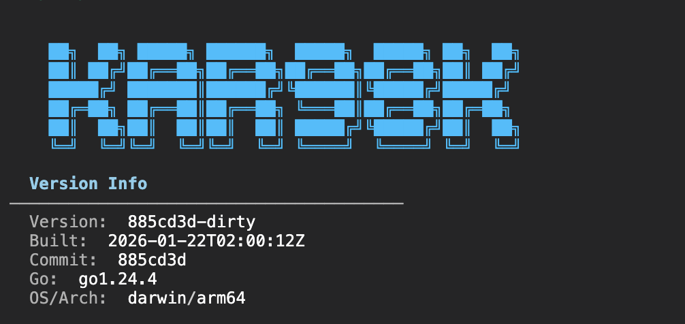
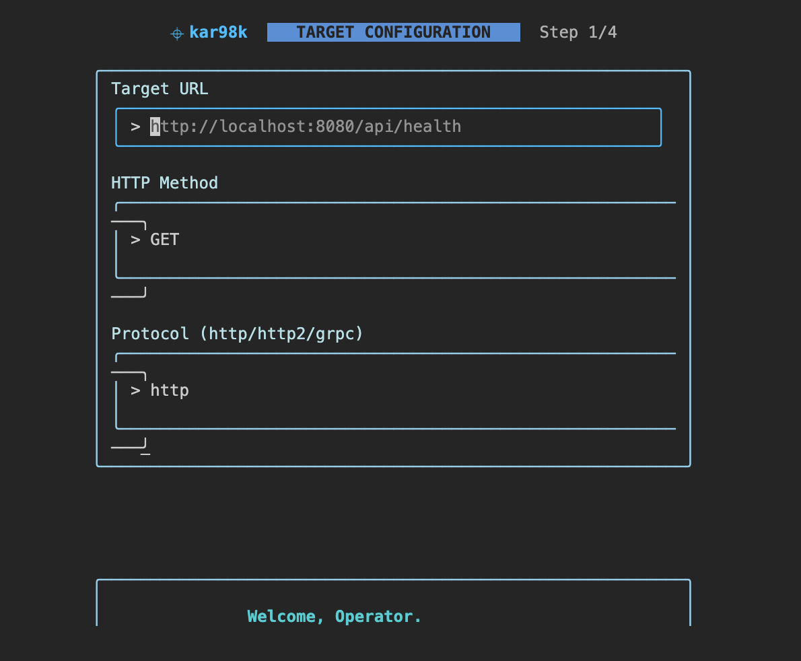
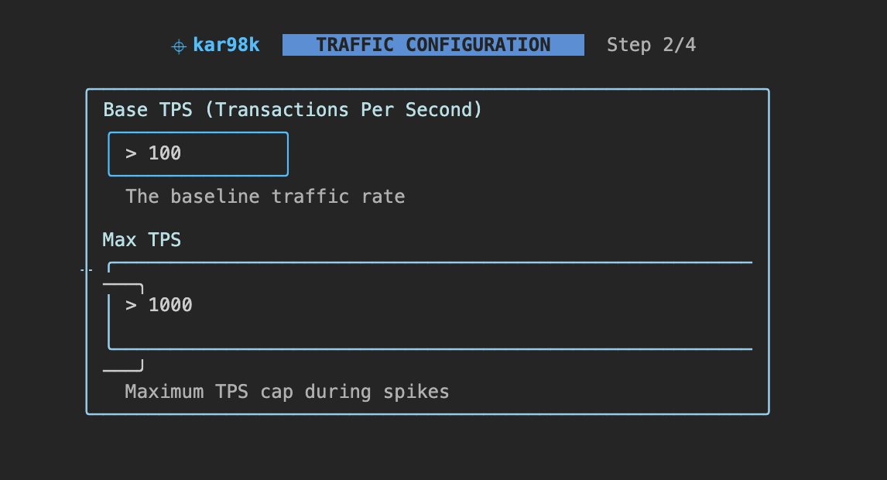
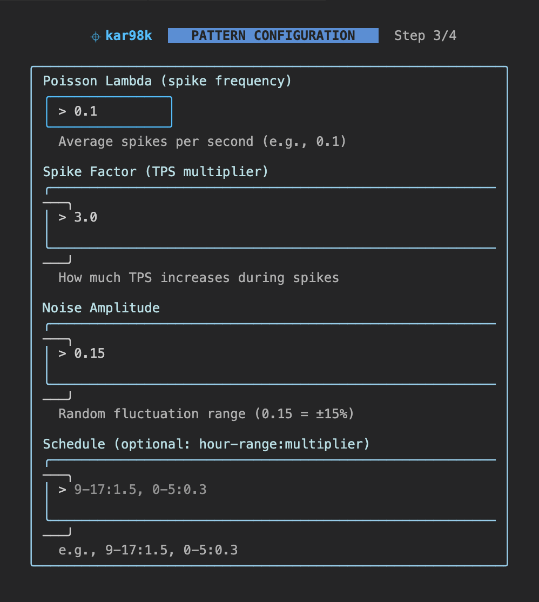
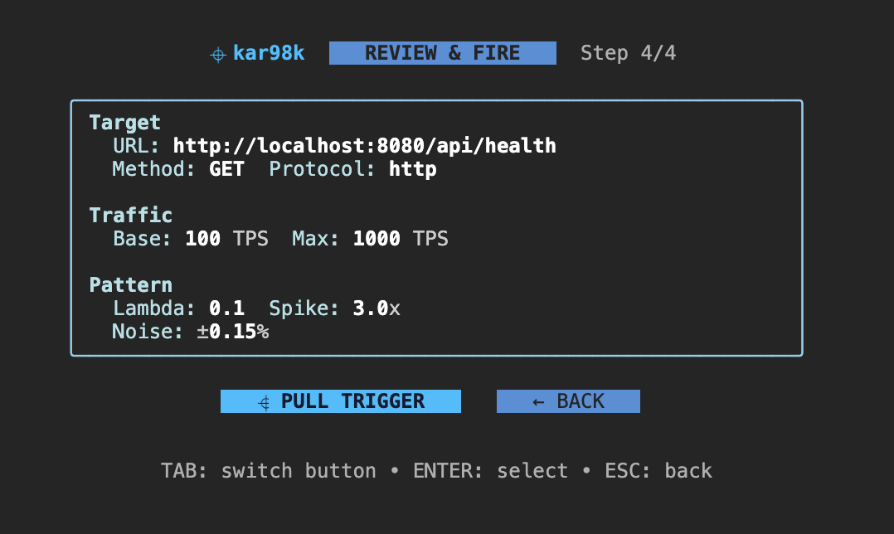

# kar98k

24/7 High-Intensity Irregular Traffic Simulation Service in Go.

kar98k generates realistic, irregular traffic patterns for load testing and performance validation of HTTP/1.1, HTTP/2, and gRPC services.



## Features

- **Interactive CLI**: Beautiful sky-blue themed TUI for easy configuration
- **Multi-Protocol Support**: HTTP/1.1, HTTP/2, and gRPC
- **Irregular Traffic Patterns**: Poisson-distributed spikes with micro-fluctuations
- **Time-of-Day Scheduling**: Configure different TPS profiles for different hours
- **Real-time Monitoring**: Live stats dashboard while traffic is flowing
- **Daemon Mode**: Run as background service with status/logs commands

## Installation

```bash
# Clone and build
git clone https://github.com/rlaope/kar98k.git
cd kar98k
make build

# Binary is at ./bin/kar
./bin/kar version
```

## Quick Start

### Interactive Mode (Recommended)

```bash
kar start
```

This launches the interactive TUI where you can configure everything step by step.

#### Step 1: Target Configuration



Configure your target endpoint:
- **Target URL**: The endpoint to send traffic to
- **HTTP Method**: GET, POST, PUT, DELETE, etc.
- **Protocol**: http, http2, or grpc

#### Step 2: Traffic Configuration



Set your traffic parameters:
- **Base TPS**: Baseline transactions per second
- **Max TPS**: Maximum TPS cap during spikes

#### Step 3: Pattern Configuration



Fine-tune the traffic pattern:
- **Poisson Lambda**: Average spikes per second (e.g., 0.1)
- **Spike Factor**: TPS multiplier during spikes (e.g., 3.0x)
- **Noise Amplitude**: Random fluctuation range (e.g., 0.15 = ±15%)
- **Schedule**: Time-based TPS multipliers (e.g., `9-17:1.5, 0-5:0.3`)

#### Step 4: Review & Fire



Review your configuration and pull the trigger!

#### Firing


Watch real-time stats as traffic flows:
- Current TPS with progress bar
- Requests sent / Errors / Avg Latency
- Elapsed time
- Press `ENTER` to pause/resume, `Q` to stop

### Headless Mode

Run with a config file for automation:

```bash
kar run --config configs/kar98k.yaml
```

### Daemon Mode

Run as a background service:

```bash
# Start daemon
kar start --daemon

# Check status
kar status

# View logs
kar logs -f

# Trigger traffic
kar trigger

# Pause traffic
kar pause

# Stop daemon
kar stop
```

## Commands

| Command | Description |
|---------|-------------|
| `kar start` | Launch interactive TUI |
| `kar start --daemon` | Start as background daemon |
| `kar run --config <file>` | Run headless with config file |
| `kar status` | Show daemon status |
| `kar logs [-f]` | View logs (with optional follow) |
| `kar trigger` | Start traffic generation |
| `kar pause` | Pause traffic generation |
| `kar stop` | Stop the daemon |
| `kar version` | Show version info |

## Configuration File

For headless/daemon mode, use a YAML config file:

```yaml
targets:
  - name: api-service
    url: http://localhost:8080/api/health
    protocol: http
    method: GET
    weight: 100

controller:
  base_tps: 100
  max_tps: 1000
  schedule:
    - hours: [9, 10, 11, 12, 13, 14, 15, 16, 17]
      tps_multiplier: 1.5

pattern:
  poisson:
    enabled: true
    lambda: 0.1
    spike_factor: 3.0
  noise:
    enabled: true
    amplitude: 0.15
```

## Architecture

```
┌─────────────────┐     ┌─────────────────┐     ┌─────────────────┐
│ Pulse-Controller│────▶│  Pattern-Engine │────▶│   Pulse-Worker  │
│   (Scheduler)   │     │ (Poisson/Noise) │     │ (Goroutine Pool)│
└─────────────────┘     └─────────────────┘     └─────────────────┘
         │                                               │
         ▼                                               ▼
┌─────────────────┐                            ┌─────────────────┐
│  Health-Checker │                            │     Targets     │
│    (Metrics)    │                            │  (HTTP/gRPC)    │
└─────────────────┘                            └─────────────────┘
```

## Metrics

Prometheus metrics are exposed at `:9090/metrics`:

- `kar98k_requests_total` - Total requests by target and status
- `kar98k_request_duration_seconds` - Request latency histogram
- `kar98k_current_tps` - Current TPS setting
- `kar98k_active_workers` - Number of active worker goroutines

## Development

```bash
# Run tests
make test

# Run with race detector
make test-race

# Build for all platforms
make build-all

# Run sample echo server for testing
make run-server

# Run full demo
make demo
```

## Docker

```bash
# Build image
make docker

# Run with docker-compose
docker-compose up
```

## License

MIT
