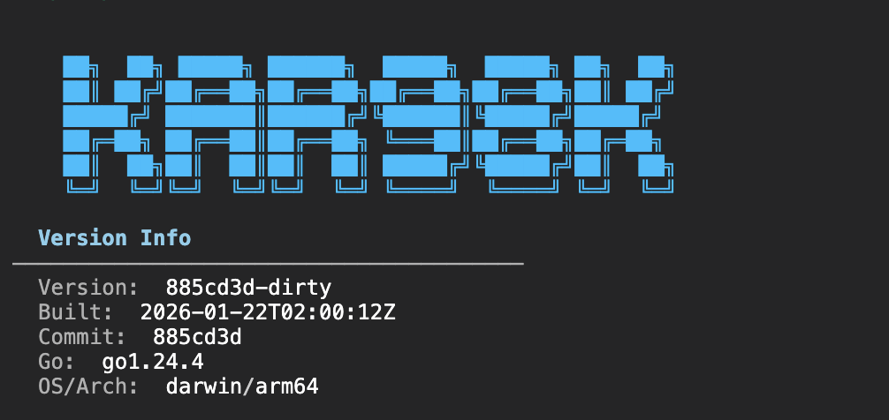

# kar98k

24/7 High-Intensity Irregular Traffic Simulation Service in Go.



## What is kar98k?

kar98k is a load testing tool that generates **realistic, irregular traffic patterns** instead of flat, constant load. Real-world traffic isn't uniform — it has random spikes, quiet periods, and micro-fluctuations. kar98k simulates all of that.

- **Poisson-distributed spikes** with configurable ramp-up/down
- **Micro-fluctuations** (noise) around the baseline TPS
- **Time-of-day scheduling** (e.g., 1.5x during business hours, 0.3x at night)
- **HTTP/1.1, HTTP/2, gRPC** support
- **Interactive TUI** and headless mode
- **Prometheus metrics** endpoint

## Quick Start

The fastest way to start:

```bash
kar quickstart http://localhost:8080/health
```

That's it. Sensible defaults are applied automatically.

### Options

```bash
# Adjust TPS
kar quickstart http://localhost:8080/api --tps 200

# Use presets: gentle, moderate, aggressive
kar quickstart http://localhost:8080/api --preset aggressive
```

| Preset | Spikes | Factor | Noise |
|--------|--------|--------|-------|
| gentle | ~every 5min | 1.5x | ±5% |
| moderate | ~every 3min | 2.0x | ±10% |
| aggressive | ~every 2min | 3.0x | ±15% |

## Installation

### Binary

```bash
# macOS (Apple Silicon)
curl -LO https://github.com/rlaope/kar98k/releases/latest/download/kar98k-darwin-arm64
chmod +x kar98k-darwin-arm64 && sudo mv kar98k-darwin-arm64 /usr/local/bin/kar

# macOS (Intel)
curl -LO https://github.com/rlaope/kar98k/releases/latest/download/kar98k-darwin-amd64
chmod +x kar98k-darwin-amd64 && sudo mv kar98k-darwin-amd64 /usr/local/bin/kar

# Linux (amd64)
curl -LO https://github.com/rlaope/kar98k/releases/latest/download/kar98k-linux-amd64
chmod +x kar98k-linux-amd64 && sudo mv kar98k-linux-amd64 /usr/local/bin/kar

# Linux (arm64)
curl -LO https://github.com/rlaope/kar98k/releases/latest/download/kar98k-linux-arm64
chmod +x kar98k-linux-arm64 && sudo mv kar98k-linux-arm64 /usr/local/bin/kar
```

### Docker

```bash
docker pull ghcr.io/rlaope/kar98k:latest
docker run --rm -it ghcr.io/rlaope/kar98k:latest version
```

### Build from Source

```bash
git clone https://github.com/rlaope/kar98k.git
cd kar98k && make build
./bin/kar version
```

## Usage Guide

### 1. Interactive Mode

Step-by-step TUI configuration:

```bash
kar start
```

Walks you through: Target URL → TPS settings → Pattern config → Review → Fire.

| Key | Action |
|-----|--------|
| `Tab` / `↓` | Next field |
| `Shift+Tab` / `↑` | Previous field |
| `Enter` | Next screen |
| `Esc` | Back |
| `Q` / `Ctrl+C` | Stop & show report |

### 2. Headless Mode

Run with a YAML config file:

```bash
kar run --config configs/kar98k.yaml --trigger
```

### 3. Adaptive Discovery

Find your system's max sustainable TPS automatically:

```bash
kar discover --url http://localhost:8080/health
```

Uses binary search with P95 latency and error rate thresholds.

### 4. Monitoring

```bash
kar status -w          # Watch mode (1s refresh)
kar logs -f            # Follow logs in real-time
kar spike --factor 5   # Trigger manual spike
```

### 5. Demo Server

A built-in echo server for testing:

```bash
make run-server
# Endpoints: /health, /api/users, /api/stats, /api/echo
```

## Commands

| Command | Description |
|---------|-------------|
| `kar quickstart <url>` | One-command start with presets |
| `kar start` | Interactive TUI configuration |
| `kar run --config <file>` | Headless mode with config file |
| `kar discover` | Auto-discover max sustainable TPS |
| `kar status` | Check running instance status |
| `kar logs` | View logs (`-f` to follow) |
| `kar spike` | Trigger manual spike |
| `kar pause` | Pause traffic |
| `kar stop` | Stop running instance |
| `kar version` | Show version info |

## Configuration

Minimal config:

```yaml
targets:
  - name: my-api
    url: http://localhost:8080/api/health
    protocol: http
    method: GET
    weight: 100
    timeout: 10s

controller:
  base_tps: 100
  max_tps: 500

pattern:
  poisson:
    enabled: true
    lambda: 0.005       # ~1 spike every 3 minutes
    spike_factor: 2.5
    min_interval: 2m
    max_interval: 10m
  noise:
    enabled: true
    amplitude: 0.10     # ±10%
```

See [full configuration reference](docs/en/configuration.md) for all options.

## Architecture

```
┌─────────────────┐     ┌─────────────────┐     ┌─────────────────┐
│ Pulse-Controller│────▶│  Pattern-Engine │────▶│   Pulse-Worker  │
│   (Scheduler)   │     │ (Poisson/Noise) │     │ (Goroutine Pool)│
└─────────────────┘     └─────────────────┘     └─────────────────┘
         │                                               │
         ▼                                               ▼
┌─────────────────┐                            ┌─────────────────┐
│  Health-Checker │                            │     Targets     │
│    (Metrics)    │                            │  (HTTP/gRPC)    │
└─────────────────┘                            └─────────────────┘
```

## Metrics

Prometheus metrics at `:9090/metrics`:

- `kar98k_requests_total` — Total requests by target/status
- `kar98k_request_duration_seconds` — Latency histogram
- `kar98k_current_tps` / `kar98k_target_tps` — Actual vs target TPS
- `kar98k_spike_active` — Spike indicator

## Documentation

- [English](docs/en/README.md)
- [한국어](docs/kr/README.md)

## License

MIT
